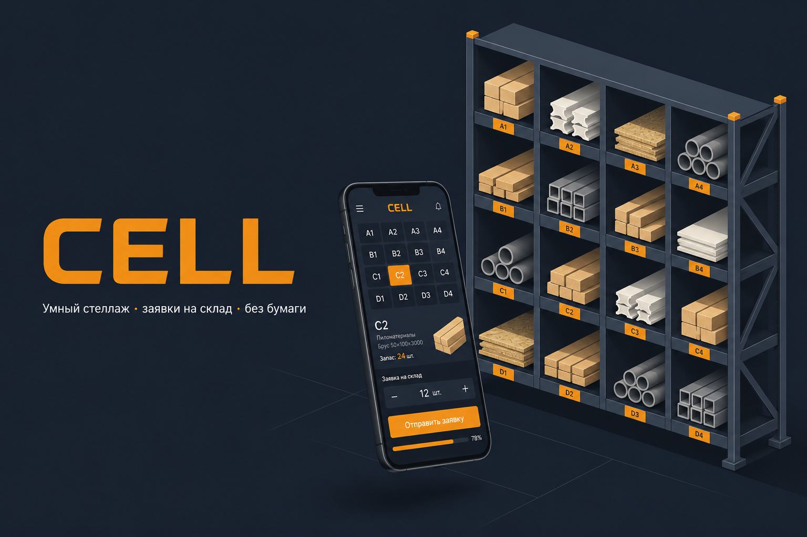

<p align="center">
  
</p>

# CELL — Учёт остатков для строймагазина

> PWA-приложение для сотрудников строительного магазина: обход стеллажа, генерация заявки на склад, чеклист при получении товара.


---

## Зачем

Раньше сотрудник ходил вдоль стеллажа с бумагой, на глаз оценивал запасы, ехал на склад, грузил и вёз. Проблемы: нет точного расчёта вместимости, бумаги теряются, непонятно что и в каком порядке грузить.

CELL решает это:

- **Считает вместимость** каждой ячейки по размерам товара и стеллажа — точно, без «на глаз»
- **Генерирует заявку** на склад автоматически по дефициту
- **Сортирует заявку** по материалу и длине — длинные доски вниз для устойчивости
- **Чеклист** при загрузке: отмечаешь что взял, приложение запоминает

---

## Как это работает

```
Обход стеллажа → Генерация заявки → Редактирование → Финализация → Чеклист → История
```

**1. Обход (Sweep)**
Сотрудник открывает стеллаж на телефоне, тапает на каждую ячейку и вводит текущий остаток. Числовой ввод для штучного товара, слайдер для насыпного.

**2. Заявка (Order)**
После обхода приложение само считает дефицит и формирует черновик заявки. Можно скорректировать количество, убрать позицию или добавить вручную из каталога.

**3. Чеклист (Checklist)**
После финализации заявки — список для работы на складе. Отметил «Взял» → позиция уходит вниз. Поддерживает частичное количество и «нет на складе».

---

## Роли

| Роль | Возможности |
|------|------------|
| **Сотрудник** | Обход стеллажа, ввод остатков, работа с чеклистом |
| **Администратор** | Всё выше + настройка стеллажа, каталог товаров, история, аналитика, управление пользователями |

---

## Стек

| Слой | Технологии |
|------|-----------|
| UI | React 19, TypeScript 6, Tailwind CSS 4, shadcn/ui, Motion 12 |
| Роутинг | React Router 7 |
| Состояние | Zustand 5 |
| Формы | React Hook Form + Zod 4 |
| Локальное хранилище | Dexie.js 4 (IndexedDB) |
| Бэкенд | Supabase (Postgres, Auth, Realtime, Edge Functions) |
| Сборка | Vite 8, vite-plugin-pwa |
| Тесты | Vitest 4 (63 юнит-теста: домен, синхронизация, потоки данных) |
| Деплой | Vercel + Supabase |

---

## Ключевые особенности

**Расчёт вместимости с поворотом**
Если доска 50×100 мм не влезает в ячейку — приложение проверяет 100×50 мм. Поддерживает штучный, круглый и насыпной товар.

**BSP-дерево стеллажа**
Ячейки можно делить горизонтально и вертикально. Каждая ячейка знает свои точные размеры.

**Online-first с офлайн-резилиентностью**
Данные читаются мгновенно из локального IndexedDB. При потере связи операции пишутся в очередь и синхронизируются при восстановлении. Realtime-подписки Supabase обновляют данные других пользователей без перезагрузки.

**Три темы**
Светлая / тёмная / OLED. Без белых вспышек при переходах.

**Встроенная документация**
Иллюстрированная справка прямо в приложении (тап по логотипу): пошаговый туториал «с чего начать» для новичка и справочник по всем функциям. Контент разделён по роли — сотрудник не видит админских разделов.

---

## Локальный запуск

**Требования:** Node.js 20+, pnpm 11+, аккаунт Supabase

```bash
git clone https://github.com/vityaayaa/cell.git
cd cell
pnpm install
```

Создай `.env` в корне:

```env
VITE_SUPABASE_URL=https://your-project.supabase.co
VITE_SUPABASE_ANON_KEY=your-anon-key
```

Примени миграции в Supabase Dashboard (SQL Editor) из папки `supabase/migrations/` по порядку — от `001_initial_schema.sql` до последней по номеру.

Задеплой Edge Functions:

```bash
supabase functions deploy create-first-admin
supabase functions deploy create-user
supabase functions deploy delete-user
```

Запусти:

```bash
pnpm dev
```

Открой `http://localhost:5173` → нажми «Создать аккаунт администратора» → первый запуск.

---

## Тесты и сборка

```bash
pnpm typecheck   # проверка типов
pnpm test        # юнит-тесты (Vitest)
pnpm build       # продакшн-сборка
```

CI запускает все три на каждый push в `main`.

---

## Деплой

Фронтенд хостится на **Vercel**, бэкенд на **Supabase**.

Push в `main` → Vercel автоматически деплоит новую версию.

Переменные окружения в Vercel:
- `VITE_SUPABASE_URL`
- `VITE_SUPABASE_ANON_KEY`

---

## Структура проекта

```
src/
├── app/          # роутер, провайдеры, шелл, навигация
├── domain/       # чистая логика: вместимость, BSP, расчёт заявки
├── data/         # Dexie, Supabase, синхронизация, Zustand
├── features/     # экраны по доменам
│   ├── auth/     # логин, онбординг
│   ├── shelf/    # стеллаж и конструктор
│   ├── stock/    # ввод остатков
│   ├── order/    # черновик заявки
│   ├── checklist/# чеклист
│   ├── catalog/  # каталог товаров
│   ├── home/     # главная, история сессий
│   └── admin/    # агрегаты, аудит, пользователи
├── ui/           # компоненты (shadcn/ui + свои)
└── lib/          # утилиты: тосты, форматирование, экспорт

supabase/
├── migrations/   # схема БД, RLS, триггеры аудита
└── functions/    # Edge Functions (создание аккаунтов)
```
